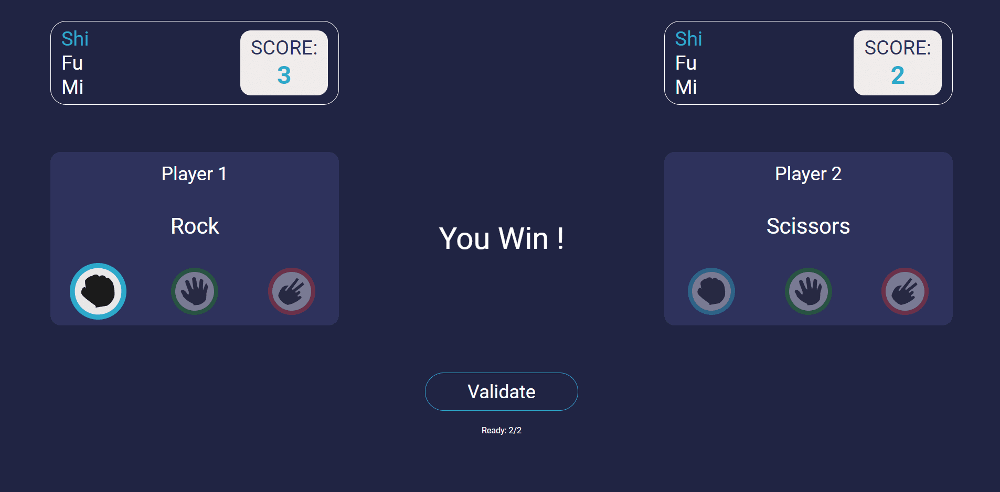

# 🎲 Shifumi


## Fullstack multiplayer game project

## ✏️ Description

**Shifumi** is an online "rock paper scissors" type game using React.js, Nodejs, Express, Socket.io technologies. <br/>
Room system managment: possibility to create or join a room with an ID. <br/>
Real-time game between two players. <br/>
Fully responsive application. <br/>

## ⚡️ Overview



## 🔥 Experience

This project allowed me to develop a complete reflection on a Full-stack project and to improve my knowledge on Back-end technologies. <br/> This project is the most significant that I have been able to do, it requires a complete reflection upstream on the architecture to be exploited. I was able to improve my Back-end skills due to the use of new tools (Socket.io).
I was also able to significantly increase the quality of my code, especially on the Front-end part of the project. <br/>
I am still working on this project to improve it as much as possible before putting it online.

## ⚙️ Techno used

    

## 🔧 Install

```
git clone https://github.com/Greepsu/Shifumi
```

### Front-end

```
cd Shifumi/client
npm start
```

### Back-end

```
cd Shifumi/server
npm start
```

## 💻 Links

Github: https://github.com/Greepsu/Shifumi
